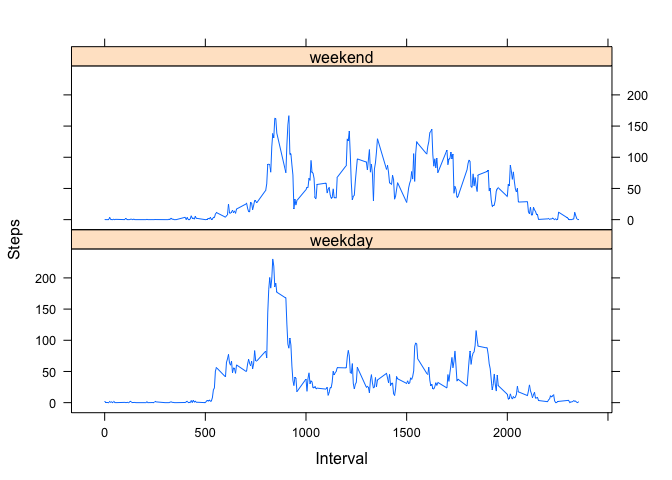

# Reproducible Research: Peer Assessment 1


## Loading and preprocessing the data


```r
unzip("activity.zip")
act <- read.csv("activity.csv", header = TRUE)
```

## What is mean total number of steps taken per day?


```r
totalsteps <- tapply(act$steps, act$date, sum, na.rm = TRUE)
```
The histogram below shows the total steps per day  

```r
hist(totalsteps, breaks = 50, xlab = "total steps")
```

 


```r
meansteps <- mean(totalsteps)
mediansteps <-median(totalsteps)
```
The mean total number of steps per day is 9354.2295082.  
The median total number of steps per day is 10395.  

## What is the average daily activity pattern?


```r
intervalsteps <- tapply(act$steps, act$interval, mean, na.rm=TRUE)
intervals <- as.data.frame(intervalsteps)
intervals$int <- rownames(intervals)
colnames(intervals) <- c("mean", "int")
```

Here is a plot of average steps taken during each 5-minute interval, across all days

```r
plot(intervals$int, intervals$mean, type = "l", xlab="interval", ylab="steps" )
```

 


```r
sortedmean <- intervals[rev(order(intervals$mean)),]
maxsteps <- sortedmean[1,2]
```
On average across all days, the 835 interval had the maximum number of steps.  

## Imputing missing values

```r
missing <- sum(!complete.cases(act))
```
The dataset is missing 2304 rows of data.  

Fill in missing values with the mean steps for that five-minute interval. 

```r
actcomplete <- act 
  for (i in 1:17568) {
		if (is.na(actcomplete[i,1]) == TRUE) {
			actcomplete[i,1] <- intervals$mean[intervals$int==act$interval[i]]
		}
	}
```

Below is a histogram of total steps per day for the new dataset with filled missing values. 

```r
daysteps <- tapply(actcomplete$steps, actcomplete$date, sum)
hist(daysteps, breaks = 50)
```

 


```r
meanday <- mean(daysteps)
medianday <- median(daysteps)
```
The mean steps per day for the new dataset is 10766.
The median steps per day for the new data set is 10766. 

When the missing values are filled in, the mean and median steps per day both increase.  The histograms show an overall increase in steps per day (and far fewer days with zero steps), so this is expected. 

## Are there differences in activity patterns between weekdays and weekends?


```r
##create factor variable to label days as weekend/weekday
actcomplete$date <- as.POSIXct(actcomplete$date, format = "%Y-%m-%d")
actcomplete$days <- weekdays(actcomplete$date)
actcomplete$wkday <- ifelse(actcomplete$days %in% c("Saturday", "Sunday"), "weekend", "weekday")
actcomplete$wkday <- as.factor(actcomplete$wkday)
```

The plot below shows average steps taken per interval, grouped by weekday and weekend days. While weekday intervals show one large peak and several smaller peaks in average steps taken during those times, weekend days show a series of peaks that are all similar in size. 


```r
library(lattice)
agg2 <- aggregate(actcomplete$steps, list(day = actcomplete$wkday, int = actcomplete$interva), mean)
xyplot(x ~ int | day, agg2, type = "l", layout = c(1,2), xlab = "Interval", ylab = "Steps")
```

 
